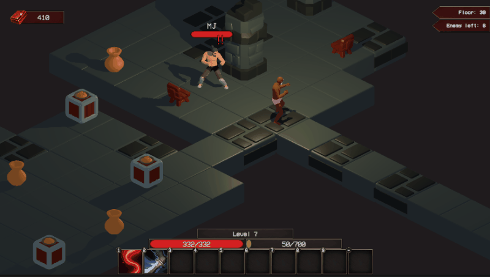
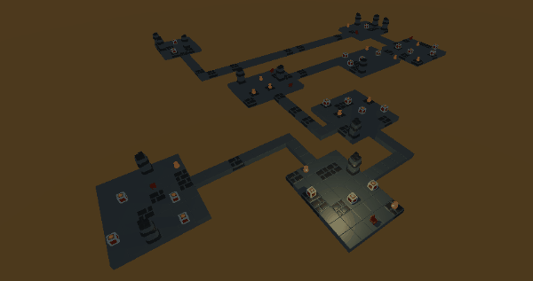
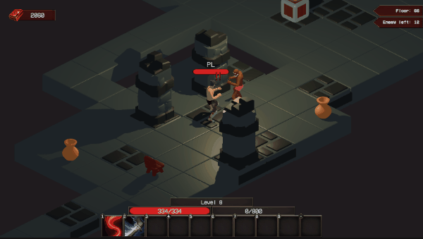
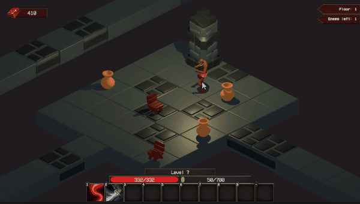
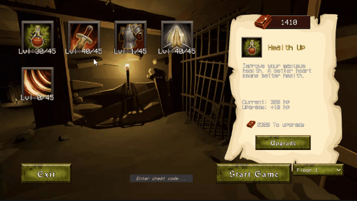
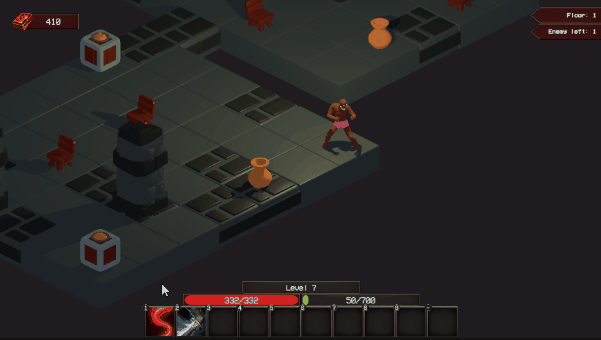
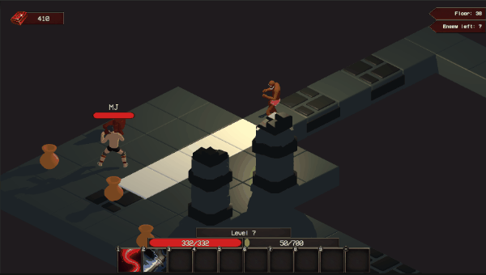

# RogueHH

RogueHH is a 3D Turn-Based Roguelike Dungeon Crawler made in Unity. Explore procedurally generated dungeon floors, battle increasingly difficult enemies, upgrade your character, and conquer the final boss. Each run offers a fresh experience with randomized layouts and strategic combat encounters.

This project was made to complete the Test Progressive Assistant (TPA) in the subject of Game Development. I was guided and tested by Hendra Hartanto, a lab assistant from BINUS Software Laboratory Center (SLC) and the casemaker of RogueHH. The game took 2 weeks to develop and achieved a score of 95/100.

**Tech Stack:** Unity, C#, Visual Studio

---

### Key Features

**Procedurally Generated Dungeons →** Never explore the same floor twice! Dungeons are randomly generated with unique room layouts, corridors, and decoration placements.

  

**Tactical Turn-Based Combat →** Engage enemies in strategic, turn-based battles. Every move, attack, and skill activation counts! Features include attack variations with sword trails, critical hits with visual feedback, and damage calculation considering enemy defense.

**Grid-Based Movement with A\* Pathfinding →** Navigate the dungeons tile by tile. Hover over a valid tile to see the shortest path highlighted using the A\* algorithm before committing to your move.

  

**Character Progression & Upgrade System →** Enhance your chances of survival! Gain Experience (EXP) and Zhen (currency) by defeating enemies. Level up to automatically boost stats and unlock skills. Spend Zhen in the Upgrade Menu to further customize Health, Attack, Defense, Critical Rate, and Critical Damage.  

**Skill System →** Unlock and utilize powerful active and passive (buff) skills as you level up. Manage cooldowns and buff durations to gain the upper hand.

**Intelligent Enemies →** Enemies exhibit different states (Idle, Alert, Aggro) based on player proximity and line-of-sight. They will pathfind towards the player once alerted.

**Enemy Variety & Scaling →** Encounter Common, Medium, and Elite enemies with distinct appearances and increasing stats. Difficulty ramps up as you descend deeper into the dungeon.

**Atmospheric Presentation →** Immerse yourself in the dungeon with:
  - Aesthetic low-poly 3D graphics.
  - Post-processing effects enhancing visual quality.
  - Dynamic point lighting centered on the player for a dark, moody feel.
  - Atmospheric background music and sound effects.

**Challenging Boss Floor →** Test your skills and build against the formidable final boss in a dedicated arena.

**Save System →** Your progress (stats, level, max floor reached, Zhen) is automatically saved, allowing you to continue your run later.

---

### Technical Highlights

- Built with Unity Engine.
- Leverages Scriptable Objects for modular data management (stats, items) and event handling (Event Bus pattern).
- Procedural generation algorithms for map creation.
- A\* Algorithm implemented for pathfinding.
- Game state saved using BinaryFormatter to `Application.persistentDataPath`.
- Implementation of multiple Design Patterns, such as Singleton, State, and Observer.
